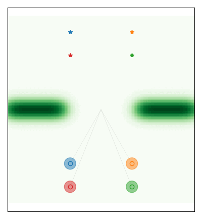

# Distributed_neurSLS Documentation
Accompanying code for the paper "Optimal distributed control with stability guarantees by training a network of neural closed-loop maps".


# DistributedREN Documentation

## Overview

This repository contains the code accompanying the paper titled "Optimal distributed control with stability guarantees by training a network of neural closed-loop maps" authored by Danilo Saccani, Leonardo Massai, Luca Furieri, and Giancarlo Ferrari Trecate.

For inquiries about the code, please contact:

- Danilo Saccani: [danilo.saccani@epfl.ch](mailto:danilo.saccani@epfl.ch)
- Leonardo Massai: [l.massai@epfl.ch](mailto:l.massai@epfl.ch)

## Repository Contents

1. **main.py**: Entry point for training the distributed operator using neural networks.
2. **utils.py**: Contains utility functions and main parameters for the codebase.
3. **models.py**: Defines models including the system's dynamical model, Recurrent Equilibrium Network (REN) model, and interconnection model of RENs.
4. **plots.py**: Includes functions for plotting and visualizing training and evaluation results.

## Getting Started

### Prerequisites

- Dependencies listed in `requirements.txt`

### Installation

1. Cloning the Repository

```bash
git clone https://github.com/DecodEPFL/Distributed_neurSLS.git
```

2. Navigate to the cloned directory:

```bash
cd Distributed_neurSLS
```
3. Install the required dependencies. We recommend using a virtual environment:
```bash
python -m venv venv
source venv/bin/activate  # Activate the virtual environment (Linux/macOS)
pip install -r requirements.txt
```

### Usage
1. Adjust parameters in utils.py as needed.
2. Run the main script to start training:
```bash
python main.py
```
## Example

### Coordination in mountains problem 

The following gifs show trajectories of the vehicles before and after the training of a distributed neurSLS controller, where the agents that need to coordinate in order to pass through a narrow passage while trying to keep a rectangular shape, starting from a random initial position marked with &#9675;.

<p align="center">


</p> 

## License
This work is licensed under a
[Creative Commons Attribution 4.0 International License][cc-by].

[![CC BY 4.0][cc-by-image]][cc-by] 

[cc-by]: http://creativecommons.org/licenses/by/4.0/
[cc-by-image]: https://i.creativecommons.org/l/by/4.0/88x31.png
[cc-by-shield]: https://img.shields.io/badge/License-CC%20BY%204.0-lightgrey.svg


